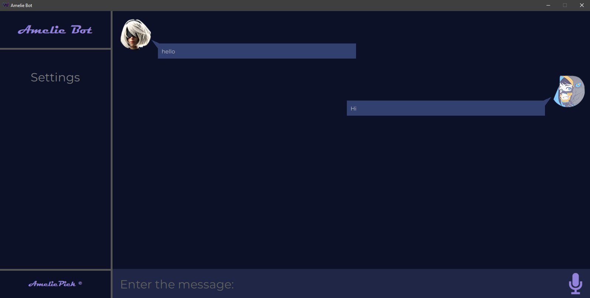
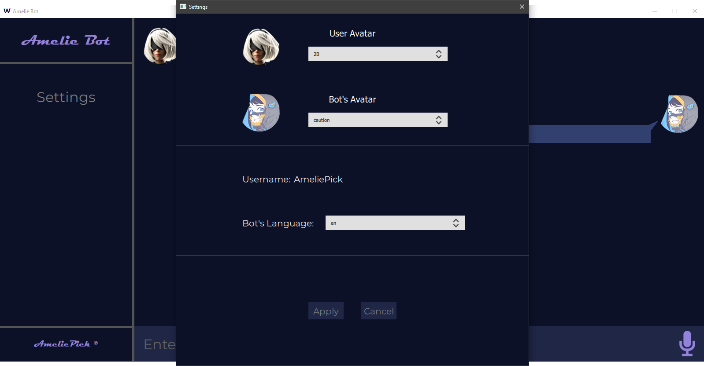

___

Amelie Bot is a chat-assistant for PC. You can chatting with Amelie by voice or just by writing a message.

 

The list of possibilities:
1. A little imitation of communication.
2. Find information in the Internet.
3. Search YouTube videos.
4. Open applications.

___

The bot has two modes:
+ Voice control and voice response. For this you need a microphone and the Ethernet connection. The bot answers by only the one voice(English) and localized subtitles.
+ Just a typing.

## Supporting languages
+ English.
+ Russian(partially).

## Versions
The bot also has two versions:
1. CLI - python console application.
2. GUI - using QT framework for C++.

___

+ CPU: i5-2410M or better.
+ RAM: 500 MB or more.
+ OS: Windows 10.

___

The core of this bot is written in Python. The GUI version is actually C++ code.
It uses Qt framework and a dynamic library builded by [python interface](https://github.com/AmeliePick/Python-Interface) and which contains calls to Python.

To run the bot, needs create a data base and setup file.

❔ Check the [wiki page](https://github.com/AmeliePick/AmelieBot/wiki/Build-Guide) for more information. ❔

___

+ _Programmers_: [AmeliePick](https://github.com/AmeliePick).
+ _Testers_: [ltachiUchiha](https://github.com/ltachiUchiha).
+ _Translators_:
    + AmeliePick -> English, Russian.

+ _Special thanks to [ex-vi](https://github.com/ex-vi)._
***

**Copyright © 2018-2020 AmeliePick.**
